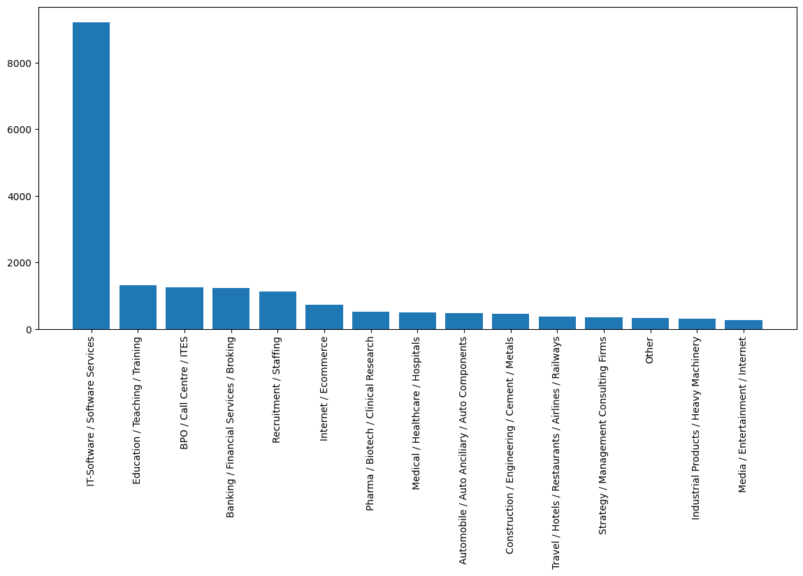
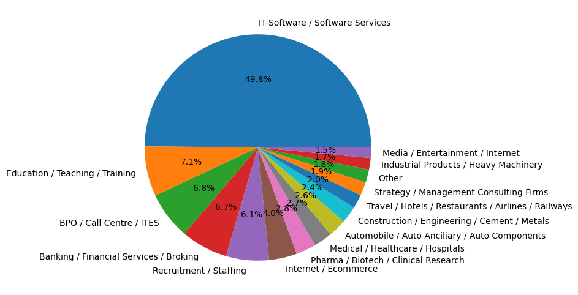
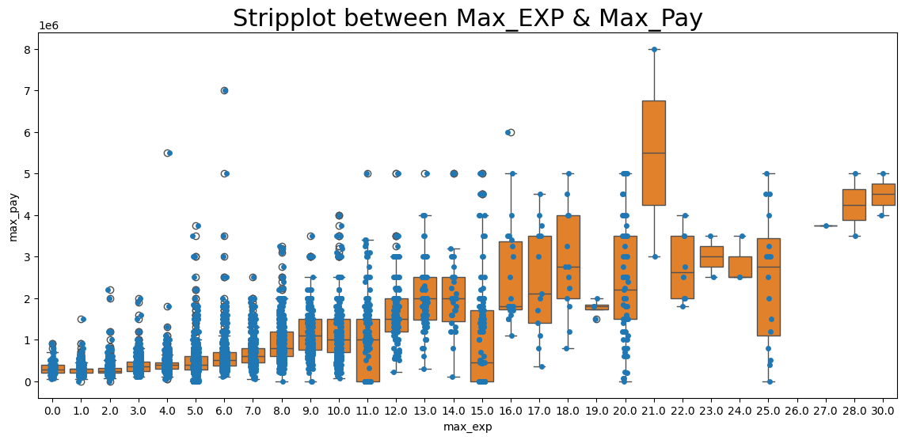
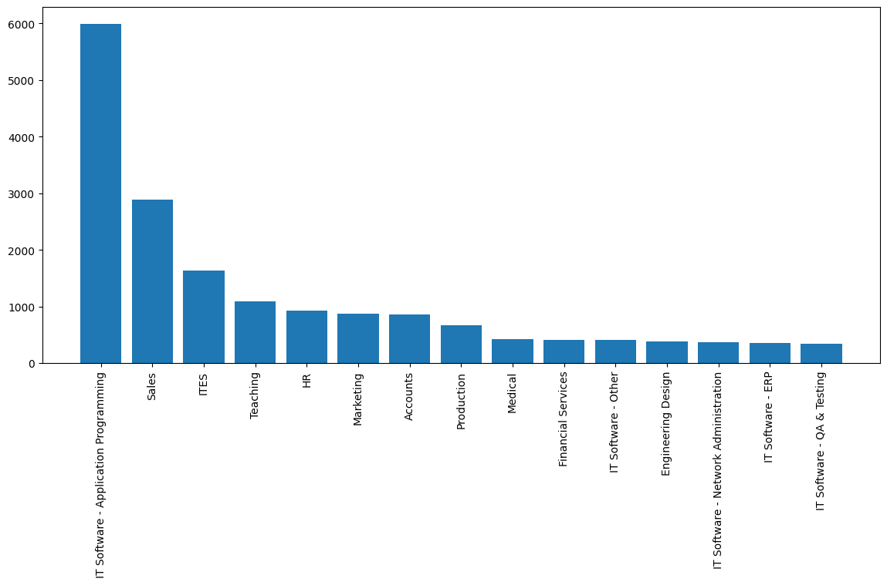

# 📊 Job Market Data Analysis (Naukri.com)

## 📌 Project Overview

This project analyzes 22,000 job postings collected from Naukri.com to uncover hiring trends, salary patterns, experience requirements, industry demand, and geographical distribution of jobs across India.

The objective of this project is to perform end-to-end Data Analysis using Python and generate actionable business insights from real-world job market data.

---

## 🎯 Business Problem

Job seekers often struggle to identify:

* Which industries are hiring the most?
* Which cities offer the most opportunities?
* What experience levels are in demand?
* Which job roles dominate the market?
* How salary varies across industries and experience levels?

This project aims to answer these questions using data-driven analysis.

---

## 📂 Dataset Information

| Attribute      | Value                       |
| -------------- | --------------------------- |
| Source         | Naukri.com                  |
| Total Records  | 22,000                      |
| Total Features | 14                          |
| Data Type      | Structured Job Posting Data |

### Original Features

* company
* education
* experience
* industry
* jobdescription
* jobid
* joblocation_address
* jobtitle
* numberofpositions
* payrate
* postdate
* site_name
* skills
* uniq_id

---

## 🛠️ Tools & Technologies Used

| Tool             | Purpose                      |
| ---------------- | ---------------------------- |
| Python           | Data Analysis                |
| Pandas           | Data Cleaning & Manipulation |
| NumPy            | Numerical Operations         |
| Matplotlib       | Data Visualization           |
| Seaborn          | Statistical Visualization    |
| Jupyter Notebook | Analysis Environment         |
| Git              | Version Control              |
| GitHub           | Project Hosting              |

---

## 🔄 Project Workflow

### 1️⃣ Business Understanding

Understanding hiring trends and job market dynamics.

### 2️⃣ Data Understanding

* Dataset Inspection
* Missing Value Analysis
* Duplicate Analysis
* Data Type Review

### 3️⃣ Data Cleaning

Performed cleaning on:

* Salary Information
* Experience Information
* Job Location
* Date Features

Removed irrelevant columns and standardized inconsistent values.

### 4️⃣ Feature Engineering

Created new features:

| Feature | Description        |
| ------- | ------------------ |
| min_pay | Minimum Salary     |
| max_pay | Maximum Salary     |
| avg_pay | Average Salary     |
| min_exp | Minimum Experience |
| max_exp | Maximum Experience |
| avg_exp | Average Experience |
| year    | Posting Year       |
| month   | Posting Month      |
| day     | Posting Day        |

### 5️⃣ Exploratory Data Analysis (EDA)

Conducted analysis on:

* Industry Distribution
* Company-wise Hiring
* Job Role Distribution
* Location Analysis
* Salary Analysis
* Experience Analysis
* Correlation Analysis

### 6️⃣ Business Insights

Generated insights and recommendations from the analysis.

---

## 📈 Key Visualizations

### Industry Analysis

### Salary Distribution

### Experience Distribution

### Top Job Roles

---

## 🔍 Key Findings

### 1. IT Industry Dominates Hiring

* IT-Software / Software Services accounts for the highest number of job postings.
* Technology remains the strongest hiring sector.

### 2. Bangalore is the Leading Hiring Hub

* Bangalore recorded the highest number of job opportunities.
* Followed by Delhi, Mumbai, Hyderabad, and Chennai.

### 3. Business Development Roles are Highly Demanded

Top job titles include:

* Business Development Executive
* Business Development Manager
* Software Engineer
* Project Manager

### 4. Software Development Skills Remain Critical

Demand is high for:

* Software Engineers
* Java Developers
* Android Developers
* Web Developers

### 5. Experience Influences Compensation

Higher experience requirements generally correspond to higher salary ranges.

---

## 📊 Business Recommendations

### For Job Seekers

* Focus on IT and Software-related skills.
* Consider opportunities in Bangalore, Delhi, and Hyderabad.
* Gain practical experience to improve earning potential.

### For Recruiters

* Technology talent remains highly competitive.
* Metro cities continue to attract the majority of skilled candidates.

### For Training Institutes

* Upskilling programs in software development and business development can address market demand.

---

## 👨‍💻 Author

**Vinay Pratap Singh**

B.Com (Hons) | Aspiring Data Analyst

📧 Email : vinaypratapsingh2608@gmail.com

💼 LinkedIn: https://www.linkedin.com/in/vinay-pratap-singh2608digital/

Skills:

* Python
* SQL | PostgreSQL
* Power BI
* Excel
* Data Analysis
* Machine Learning

---

## ⭐ If you found this project useful, please consider giving it a star.
